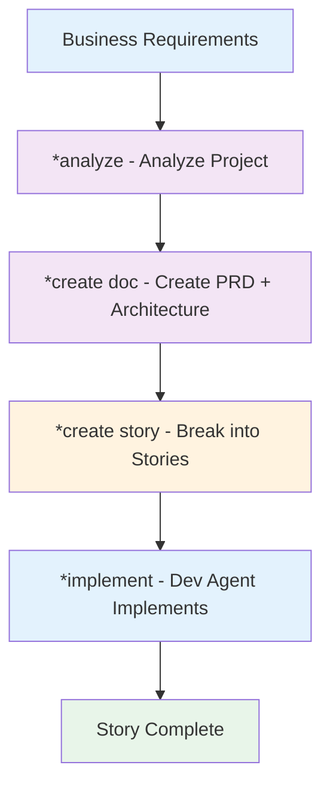

This is a reduced, portable directory you can paste into any project and start directing your LLM to use by adhering to the workflows/complete-bmad-process-flow.md.  Customize as you see fit. 

Below is the original readme from which this was distilled from: https://github.com/bmad-code-org/BMAD-METHOD/blob/main/docs/user-guide.md

# BMAD Universal Base Framework

A **project-agnostic foundation** for creating specialized BMAD Method implementations. This base framework provides the core BMAD methodology with story-driven development for any technology stack or domain.

## What is BMAD Method?

**BMAD (Breakthrough Method of Agile AI-Driven Development)** solves the two biggest problems in AI-assisted development:

1. **Planning Inconsistency** - AI plans are often generic and inconsistent
2. **Context Loss** - Implementation agents lose planning context during handoffs

### BMAD's Solution: Story-Driven Development

BMAD uses **story files** as context carriers that eliminate context loss:

- **Planning Agents** (rich context) create comprehensive PRDs and Architecture documents
- **Scrum Master** converts plans into detailed story files with complete context  
- **Dev Agents** (lean, focused) implement stories autonomously with full understanding
- **QA Agents** validate against story specifications

## Universal Base Framework

This repository is the **universal foundation** that can be cloned and specialized for any domain:

```
bmad/                           # This base framework
├── agents/                     # Universal agents (Master, Architect, Dev)
├── tasks/                      # Natural language task definitions
├── templates/                  # Story and document templates
├── workflows/                  # Core BMAD workflows
└── stories/                    # Generated story files

bmad-ecommerce/                 # E-commerce specialization
├── agents/                     # E-commerce specific agents
├── tasks/                      # Domain-specific tasks  
├── templates/                  # E-commerce templates
└── workflows/                  # E-commerce workflows

bmad-security/                  # Security audit specialization
bmad-api/                       # API development specialization
bmad-gamedev/                   # Game development specialization
```

## Quick Start

### 1. Clone and Specialize

```bash
# Clone this base framework
cp -r bmad bmad-yourspecialization

# Customize for your domain
cd bmad-yourspecialization
# Add domain-specific agents, tasks, and templates
```

### 2. Use with LLMs

**For Planning (Web UI)**:
1. Copy `agents/bmad-master.md` content
2. Create new Claude/Gemini/ChatGPT conversation
3. Paste agent content to activate BMAD Master
4. Type `*help` to see capabilities

**For Development (IDE)**:
1. Copy `agents/dev-agent.md` content  
2. Create new Claude/Cursor/VS Code conversation
3. Activate dev agent and provide story files
4. Dev agent implements features autonomously

### 3. Core Workflow



## Framework Components

### Agents (Markdown + YAML)

**Planning Agents** (Rich Context - Web UI):
- `bmad-master.md` - Universal project analysis and orchestration
- `architect.md` - System architecture and technical design

**Development Agents** (Lean Context - IDE):  
- `dev-agent.md` - Feature implementation from story files

### Natural Language Tasks

All tasks are **pure natural language** instructions:
- `analyze-project.md` - Analyze any project structure and tech stack
- `create-story.md` - Create comprehensive story files with full context
- `implement-story.md` - Implement features autonomously from stories

### Templates (YAML)

**Structured document generation**:
- `story-template.yaml` - Complete story template with all context sections
- `prd-template.yaml` - Product Requirements Document template  
- `architecture-template.yaml` - System architecture documentation

### Workflows

**Story-driven development process**:
- `story-driven-development.md` - Core BMAD workflow documentation
- `planning-to-implementation.md` - End-to-end process guide

## Key Features

### 🎯 Project-Agnostic Design
- Works with any programming language or framework
- Adapts to existing codebases and patterns
- Maintains architectural consistency

### 🧠 LLM-Native Execution  
- Agents are markdown files with YAML configuration
- No Python orchestration - LLMs execute directly
- Natural language task definitions

### 📋 Story-Driven Context Preservation
- Complete implementation context in every story file
- No context loss between planning and development
- Autonomous agent execution with full understanding

### 🔧 Specialization Ready
- Clone base framework for any domain
- Add specialized agents for your needs
- Inherit all core BMAD methodology

## Usage Examples

### Analyze Any Project

```bash
# Activate BMAD Master agent and run:
*analyze

# Provides recommendations for:
# - Technology stack assessment  
# - BMAD implementation strategy
# - Specialized agents needed
# - Custom workflows required
```

### Create Implementation Stories

```bash
# From PRD and Architecture documents:
*create story

# Generates complete story files with:
# - User story and business context
# - Acceptance criteria (Given-When-Then)
# - Technical implementation guidance  
# - Testing requirements
# - Definition of done
```

### Autonomous Implementation

```bash
# Dev agent reads story file and implements:
*implement story-user-auth-001-login.md

# Autonomously creates:
# - Complete feature implementation
# - Comprehensive test coverage
# - Documentation updates
# - Quality validation
```

## Specialization Guide

### Creating Domain-Specific BMAD

1. **Clone Base Framework**:
   ```bash
   cp -r bmad bmad-ecommerce
   ```

2. **Add Specialized Agents**:
   ```markdown
   # agents/product-manager.md
   # agents/payment-specialist.md 
   # agents/inventory-manager.md
   ```

3. **Create Domain Tasks**:
   ```markdown
   # tasks/design-checkout-flow.md
   # tasks/implement-payment-gateway.md
   # tasks/optimize-product-catalog.md
   ```

4. **Customize Templates**:
   ```yaml
   # templates/ecommerce-story-template.yaml
   # templates/product-spec-template.yaml
   ```

### Example Specializations

**E-commerce BMAD**:
- Product Manager, Payment Specialist, Inventory Manager agents
- Checkout flow, payment integration, catalog optimization tasks
- E-commerce story templates with conversion tracking

**Security BMAD**:
- Security Auditor, Penetration Tester, Compliance Specialist agents  
- Vulnerability assessment, security review, compliance check tasks
- Security-focused story templates with threat modeling

**API Development BMAD**:
- API Designer, Integration Specialist, Documentation Expert agents
- API design, integration planning, documentation generation tasks
- API-focused templates with OpenAPI specifications

## Architecture Principles

### Natural Language First
- **Everything is markdown** - agents, tasks, templates
- **No code in framework** - pure natural language orchestration
- **Self-contained templates** - YAML with embedded instructions

### Agent Specialization  
- **Planning Agents** - Rich context, comprehensive analysis, web UI
- **Dev Agents** - Lean context, focused implementation, IDE optimized
- **Story Files** - Complete context carriers between agents

### Quality by Design
- **Comprehensive acceptance criteria** in every story
- **Built-in testing requirements** with coverage expectations
- **Definition of done** with measurable quality gates

## Contributing

1. **Follow BMAD Principles**: Natural language first, agent specialization
2. **Maintain Project-Agnostic Design**: Works with any tech stack
3. **Test with Multiple LLMs**: Ensure compatibility across AI models
4. **Document Everything**: Clear usage instructions and examples

## Community

- **Discord**: [BMAD Method Community](https://discord.gg/gk8jAdXWmj)
- **YouTube**: [BMadCode Channel](https://www.youtube.com/@BMadCode)
- **GitHub**: [Official BMAD Method](https://github.com/bmad-code-org/BMAD-METHOD)

## License

MIT License - Fork, modify, and specialize for your needs.

---

**Ready to eliminate context loss in AI-assisted development?**

Clone this base framework, specialize it for your domain, and experience autonomous AI agents that never lose context between planning and implementation.
